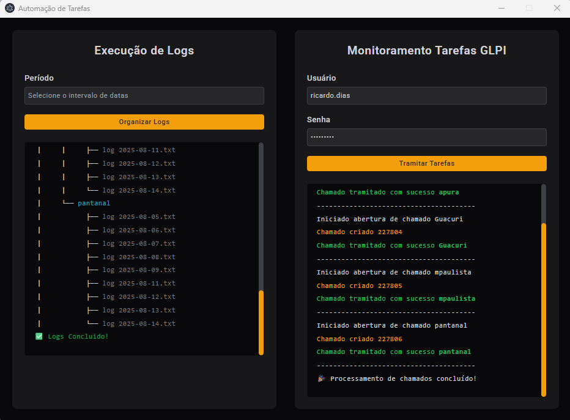

# APLICAÇÃO ANALISE DE LOGS INFRA - INTS

 <!-- Placeholder for a banner image; replace with actual if available -->

## Descrição

A **APLICACAO-ANALISE-DE-LOGS-INFRA** é uma aplicação front-end inovadora projetada para automatizar a análise e o gerenciamento de logs de infraestrutura de TI. Desenvolvida com foco em eficiência e integração seamless, esta ferramenta lê arquivos de logs armazenados em pastas específicas, padroniza seu conteúdo e os categoriza com base em critérios de data, horário e status de execução (sucesso ou erro). 

Uma vez processados, os logs são integrados diretamente ao sistema GLPI, uma plataforma open-source de gerenciamento de serviços de TI. A aplicação abre chamados (tickets) automaticamente, anexa os logs organizados e gerencia o fluxo de trabalho: tickets com apenas logs de sucesso são encerrados imediatamente, promovendo uma resolução rápida e autônoma; enquanto aqueles com erros detectados permanecem abertos, alertando equipes de suporte para investigação detalhada. 

Essa abordagem não apenas reduz o tempo gasto em tarefas manuais de monitoramento, mas também minimiza riscos operacionais, melhora a rastreabilidade de incidentes e eleva a maturidade dos processos de DevOps e ITIL em ambientes corporativos. Imagine um "guardião digital" que transforma pilhas de dados brutos em insights acionáveis, prevenindo downtime e otimizando recursos – essa é a essência criativa por trás desta aplicação.

## Objetivo

O principal objetivo desta aplicação é simplificar o monitoramento de logs de infraestrutura, transformando dados dispersos em ações automatizadas e inteligentes. Especificamente:

- **Automação de Análise**: Eliminar a necessidade de revisão manual de logs, identificando padrões de sucesso e falhas em tempo real.
- **Integração com GLPI**: Facilitar a criação e gerenciamento de tickets de suporte, garantindo que erros sejam priorizados e sucessos sejam documentados sem intervenção humana desnecessária.
- **Eficiência Operacional**: Reduzir o tempo de resposta a incidentes, promover a proatividade na manutenção de sistemas e fornecer uma interface amigável para visualização de resultados.
- **Escalabilidade e Customização**: Projetado para ambientes de TI variados, permitindo adaptações criativas para diferentes tipos de logs (ex.: servidores, aplicações, redes) e integrações futuras com outras ferramentas de ITSM.

Em resumo, esta aplicação visa empoderar equipes de TI a focarem em inovação e estratégia, em vez de tarefas repetitivas, fomentando uma cultura de resiliência digital.

## Funcionalidades Principais

- **Leitura e Padronização de Logs**: Escaneia pastas configuráveis para extrair logs, aplicando filtros por data e horário, e normalizando formatos para análise consistente.
- **Categorização Inteligente**: Separa logs em categorias de "Sucesso" e "Erro" usando critérios personalizáveis (ex.: códigos de status, palavras-chave de erro).
- **Integração com GLPI**:
  - Abertura automática de tickets com anexos de logs organizados.
  - Fluxo de trabalho dinâmico: Encerramento imediato para logs sem erros; manutenção aberta para investigação em casos de falhas.
- **Interface Front-End Intuitiva**: Uma tela amigável com dashboards para visualização de resumos, gráficos de tendências e alertas em tempo real.

## Tecnologias Utilizadas

- **Front-End**: HTML5, CSS3, JavaScript (com frameworks como React ou Vue.js para interfaces dinâmicas – verifique o código-fonte para detalhes).
- **Back-End/Processamento**: Node.js para lógica de leitura de arquivos e integração API (assumindo base no repositório).
- **Integração**: API REST do GLPI para automação de tickets.

## Instalação

1. **Pré-Requisitos**:
   - Node.js (versão 14+ recomendada) ou ambiente equivalente.
   - Acesso a uma instância GLPI configurada com credenciais API.
   - Pastas de logs acessíveis no sistema de arquivos local ou via rede.

2. **Executando a Aplicação**:
   ```
   index.html
   ```
   Acesse via navegador em `http://localhost:3000` (porta padrão; ajuste conforme necessário).

 3. **Instalação executavel na maquina.**:

    ```
    npm run build
    ```

    ```
    npm run start
    ```
    Executavel será criado na raiz do projeto dentro da pasta dist

## Uso

1. **Interface Principal**: Ao acessar a aplicação, selecione pastas de logs ou configure scans automáticos.
2. **Análise de Logs**: Clique em "Analisar" para processar os arquivos. A aplicação exibirá um resumo com separação por sucesso/erro.
3. **Integração GLPI**: Se erros forem detectados, um ticket será criado automaticamente. Monitore o status diretamente no GLPI.

## Contato

- **Autor**: Ricardo Tavares Dias
- **GitHub**: [RicardoTavaresDias](https://github.com/RicardoTavaresDias)
- **Issues**: Abra uma issue para reportar bugs ou sugerir melhorias.